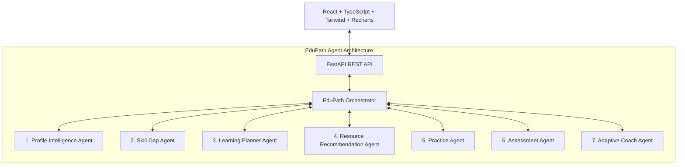

# EduPath — Personalized Learning & Skill Gap Agent

> **Agentic AI Web Application built for Agentic AI Hackathons**

EduPath is a genuinely adaptive AI learning agent that solves the fragmented, one-size-fits-all learning dilemma. Instead of presenting a static chatbot or generic course list, EduPath **observes learner capabilities, analyzes skill gaps against target career roles, formulates personalized roadmaps, monitors assessment performance to detect repeated struggles, automatically replans the learning journey, and exposes an explicit Agent Decision Trace.**

---

## 🚀 Key Agentic Features & Architecture

EduPath implements a 7-agent closed feedback loop:

$$\text{UNDERSTAND} \longrightarrow \text{ANALYZE} \longrightarrow \text{IDENTIFY GAPS} \longrightarrow \text{PLAN} \longrightarrow \text{PRACTICE} \longrightarrow \text{ASSESS} \longrightarrow \text{ADAPT} \longrightarrow \text{REPLAN}$$



### The 7 Conceptual Sub-Agents
1. **Profile Intelligence Agent**: Parsed PDF resume evidence, ingests self-reported levels, cross-references project experience, and establishes ground-truth capability profile.
2. **Skill Gap Agent**: Benchmarks ground-truth capabilities against target career role requirements (Full Stack, Frontend, Backend, AI/ML, Data Analyst, Cloud, etc.) and categorizes gaps into `Critical`, `High`, `Moderate`, or `Acquired`.
3. **Learning Planner Agent**: Generates phase-by-phase learning roadmaps and personalized daily micro-schedules based on hours/day availability.
4. **Resource Recommendation Agent**: Curates videos, docs, and courses with explicit *"Why recommended?"* context.
5. **Practice Agent**: Generates difficulty-tiered coding tasks (`Beginner`, `Intermediate`, `Challenge`, `Mini Project`) with starter code and solution hints.
6. **Assessment Agent**: Generates quiz checks, evaluates answers, scores performance, and pinpoints exact weak topics.
7. **Adaptive Coach Agent**: Detects repeated struggles (e.g. <60% score in React Hooks across attempts), dynamically alters the learning plan by inserting targeted reinforcement modules, and records the **Agent Decision Trace**.

---

## 🛠️ Tech Stack

- **Frontend**: React 18, TypeScript, Vite, Tailwind CSS, Lucide React icons, Recharts (for radar and bar charts), React Router DOM v6.
- **Backend**: Python 3.10+, FastAPI, Uvicorn, Pydantic v2, HTTPX.
- **AI Service Abstraction**: Flexible provider-agnostic `AIService` supporting OpenAI / Gemini API via `LLM_API_KEY`, with zero-config mock fallback.
- **Demo State Engine**: Built-in thread-safe session database pre-loaded with sample learner *Alex Morgan*.

---

## ⚙️ Setup & Running Locally

### 1. Prerequisites
- Node.js 18+ and npm
- Python 3.10+ and pip

### 2. Backend Setup
```bash
cd backend
python -m venv venv
# On Windows PowerShell:
.\venv\Scripts\Activate.ps1
# On Linux/macOS:
source venv/bin/activate

pip install -r requirements.txt
cp .env.example .env
# Optional: Add LLM_API_KEY in .env

# Run FastAPI Server (Port 8000)
uvicorn main:app --reload --port 8000
```
Backend API will be live at: `http://localhost:8000`  
API Swagger Docs: `http://localhost:8000/docs`

### 3. Frontend Setup
```bash
cd frontend
npm install
npm run dev
```
Frontend Web App will be live at: `http://localhost:3000`

---

## 🏆 Demo Flow (Step-by-Step)

1. **Open Landing Page**: Visit `http://localhost:3000` and click **"Build My Learning Path"**.
2. **Onboarding**: Click **"Use Demo Profile"** to pre-fill *Alex Morgan* (Junior Developer targeting *Full Stack Developer + AI*).
3. **Resume Analysis**: Click **"Use Sample PDF Resume"** to trigger the *Profile Intelligence Agent* extraction animation.
4. **Skill Gap Matrix**: View ground-truth capability radar chart and priority gap list (React Hooks & REST APIs highlighted as *Critical Gaps*).
5. **Personalized Roadmap & Weekly Plan**: Inspect generated phases and interactive day-by-day weekly checkboxes.
6. **Simulate Low Performance / Struggle**:
   - Click the top navbar button: **⚡ "Simulate Struggle (48%)"** (or take the React Hooks quiz and submit low score).
   - Observe the live **Struggle Detected** notification alert.
7. **Agent Decision Trace**:
   - Click **"Decision Trace"** to view live step-by-step reasoning:
     $$\text{OBSERVATION} \longrightarrow \text{EVIDENCE} \longrightarrow \text{DECISION} \longrightarrow \text{ACTION} \longrightarrow \text{RESULT}$$
8. **Dynamic Roadmap Modification**:
   - Notice that Phase 1 dynamically changes to **`Phase 1 (Reinforcement): React Hooks & Async State Deep-Dive`**.
9. **Contextual AI Learning Assistant**:
   - Open the bottom-right **AI Assistant** drawer and ask: *"Why did my roadmap change?"*
   - Observe the agent's context-aware reply referencing your 48% assessment score.

---

## 🔑 Environment Variables

Create `.env` inside `/backend`:
```env
LLM_API_KEY=your_openai_or_gemini_api_key_here
LLM_MODEL=gpt-4o-mini
PORT=8000
HOST=0.0.0.0
```
*(Note: If `LLM_API_KEY` is omitted, EduPath automatically uses its internal heuristic demo engine so the app functions 100% reliably out-of-the-box!)*
